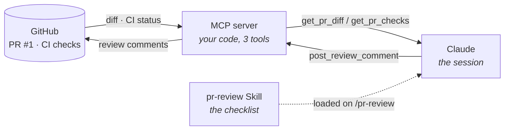

# mcp-skill-demo

**Claude reviews a real GitHub pull request for a real security bug —
live, out loud, with nothing pasted in by hand.** This repo is the
whole thing: the buggy code, the MCP server that gives Claude eyes on
GitHub, and the Skill that tells it what to actually check for.

▶️ **[See the bug it catches: PR #1](https://github.com/Roli24/mcp-skill-demo/pull/1)**

---

## What's actually going on here

Two pieces, doing two different jobs:

- **An MCP server** — a small program *you* write and run, that gives
  Claude a live connection to something outside the chat (here:
  GitHub). Without it, Claude only knows what you paste in.
- **A Skill** (`SKILL.md`) — the checklist. It tells Claude *what to
  look for* and *when to use the connection*, so "review this PR"
  means the same thing every time, not whatever you happen to type
  that day.



The MCP server never decides *what's wrong* with the code — it just
fetches and posts. The Skill never touches GitHub directly — it just
reasons. Neither one does the whole job alone.

## The bug it finds

[`app.py`](./app.py)'s `search_users()` endpoint (added in PR #1)
builds SQL with string concatenation:

```python
sql = "SELECT id, username, is_admin FROM users WHERE username LIKE '%" + query + "%'"
```

— classic injection — and the PR description quietly defers the
missing admin-role check to "a follow-up ticket." Both are exactly the
kind of thing that's easy to wave through in a fast review and easy
for a checklist to catch every time.

## Run it yourself, two ways

| | **Claude Code** (local) | **claude.ai** (remote) |
|---|---|---|
| Transport | stdio — a subprocess Claude Code spawns | Streamable HTTP — a server you deploy |
| Where your GitHub token lives | Your machine, never leaves it | Your deployed host, never sent to claude.ai |
| Auth claude.ai/Claude Code holds | — (it's local) | A separate OAuth client secret, not your GitHub token |
| Setup | `.mcp.json`, already committed | Deploy + connector + skill upload |
| Guide | [`RUNBOOK.md`](./RUNBOOK.md) | [`CLAUDE_AI_SETUP.md`](./CLAUDE_AI_SETUP.md) |

Both paths run the exact same three tools and the exact same
`SKILL.md` — see [`mcp-server/github_tools.py`](./mcp-server/github_tools.py),
shared by both transports so they can't drift into different behavior.

## Why bother wiring this up

- **Live grounding, not copy-paste** — Claude reads the real diff and
  CI status. Nothing pasted by hand, nothing goes stale mid-review.
- **A repeatable checklist** — the Skill runs the same correctness/
  security pass every time, not a fresh ad hoc prompt.
- **You control the blast radius** — three tools, not GitHub's whole
  API. A bug in the Skill can't reach further than that.
- **The loop closes** — the same server that pulled the PR in posts
  findings back as inline comments. Starts and ends on GitHub.
- **One codebase, two surfaces** — `github_tools.py` doesn't care
  whether it's called over stdio or HTTP.

## Where it actually falls short

- **A credential still has to live somewhere** — locally, that's your
  shell env; remotely, that's a deployed host you now maintain. Either
  way it needs scoping and rotation like any secret.
- **Cost and latency scale per call** — fine for reviewing one PR on
  camera, not a drop-in replacement for a CI bot reviewing hundreds.
- **First pass, not sign-off** — it can miss a real bug or flag a
  fine line as risky. A human still holds the merge button.
- **You own what you deploy** — the remote path adds a real OAuth
  server (`remote_server.py`) that you're now responsible for keeping
  patched, not just calling.
- **More moving parts than a plain prompt** — worth it for a
  repeatable workflow, overkill for a one-off question.

## Repo layout

```
app.py, test_app.py            the buggy demo API (main = safe, feature/admin-user-search = bug)
.claude/skills/pr-review/       the Skill — same file, both paths
mcp-server/github_tools.py      shared GitHub REST logic
mcp-server/server.py            stdio transport (Claude Code)
mcp-server/remote_server.py     Streamable HTTP + OAuth 2.1 (claude.ai)
.mcp.json                       declarative local registration
RUNBOOK.md / CLAUDE_AI_SETUP.md exact steps for each path
```
