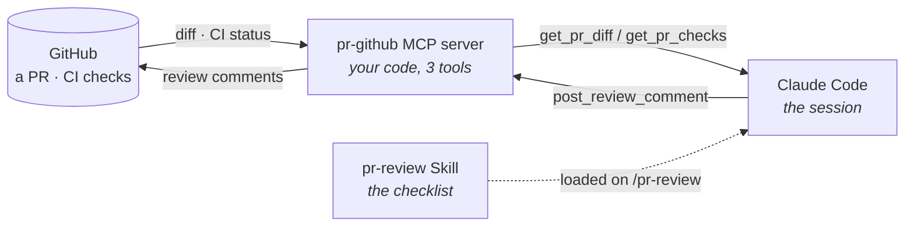

# mcp-skill-demo

An MCP server and a Skill working together in Claude Code: Claude reads
a real GitHub pull request, reviews it against a fixed checklist, and
can post its findings back as review comments — no diff pasted in by
hand, no manual copy-paste in either direction.

`main` is always clean and safe. [`make-demo-pr.sh`](./make-demo-pr.sh)
opens a fresh branch and PR that introduces a real bug, so there's
always a live, unmerged PR to review instead of a permanent fixture
baked into the default branch.

---

## What's actually going on here

Two pieces, doing two different jobs:

- **An MCP server** — a small program *you* write and run, that gives
  Claude a live connection to something outside the chat (here:
  GitHub). Without it, Claude only knows what you paste in.
- **A Skill** (`SKILL.md`) — the checklist. It tells Claude *what to
  look for* and *when to use the connection*, so "review this PR"
  means the same thing every time, not whatever you happen to type
  that day.



The MCP server never decides *what's wrong* with the code — it just
fetches and posts. The Skill never touches GitHub directly — it just
reasons. Neither one does the whole job alone.

## Where the two files actually live

```
.mcp.json                        <- Claude Code reads this on startup;
                                     declares & launches the MCP server
mcp-server/server.py             <- the server: 3 tools, stdio transport
mcp-server/github_tools.py       <- the GitHub REST calls those tools use
.claude/skills/pr-review/SKILL.md <- auto-discovered; registers /pr-review
```

`.mcp.json` says *what's available* (spawns `server.py`, gets back
`get_pr_diff` / `get_pr_checks` / `post_review_comment`). `SKILL.md`
says *what to do with it* (the checklist, run when you type
`/pr-review`). They never talk to each other directly — they meet
inside Claude's own reasoning.

## The bug it finds

`./make-demo-pr.sh` opens a PR that adds a `search_users()` endpoint to
[`app.py`](./app.py), building SQL with string concatenation:

```python
sql = "SELECT id, username, is_admin FROM users WHERE username LIKE '%" + query + "%'"
```

— classic injection — and the PR description quietly defers the
missing admin-role check to "a follow-up ticket." Both are exactly the
kind of thing that's easy to wave through in a fast review and easy
for a checklist to catch every time.

## Install Claude Code

Skip this if `claude --version` already works. Otherwise:

**macOS / Linux / WSL** — native installer, no Node.js required:
```bash
curl -fsSL https://claude.ai/install.sh | bash
```
macOS alternative, if you prefer Homebrew:
```bash
brew install claude-code
```

**Windows** — native installer, in PowerShell (no WSL, Node, or npm needed):
```powershell
irm https://claude.ai/install.ps1 | iex
```

Either way, confirm it worked:
```bash
claude --version
```

You'll also need Python 3 and `git` on your PATH — this demo's MCP
server is a Python script, and you'll be cloning the repo below.

## Set up

```bash
git clone https://github.com/Roli24/mcp-skill-demo && cd mcp-skill-demo

cd mcp-server && python3 -m venv venv && source venv/bin/activate
pip install -r requirements.txt && cd ..
```

Generate a fine-grained GitHub PAT (Settings → Developer settings →
Personal access tokens → Fine-grained), scoped to just this repo, with
`Contents: Read` and `Pull requests: Read and write`. `.mcp.json`
expands it from your shell at launch — the literal token is never
written to disk:

```bash
export GH_PAT="your-fine-grained-github-pat"
```

Open a fresh demo PR (requires `gh auth login` once, if you haven't):

```bash
./make-demo-pr.sh   # prints the PR number, e.g. #4
```

## Run it

```bash
claude   # approve the pr-github MCP server when prompted
```

Inside the session:

```
what's the status of PR #<N> in Roli24/mcp-skill-demo — show me the diff and any CI checks
/pr-review PR #<N>
/pr-review PR #<N> --comment   # posts findings back to the PR
```

`claude mcp list` confirms `pr-github` is connected with exactly 3
tools. The first command shows Claude pulling live context via
`get_pr_diff` / `get_pr_checks`; `/pr-review` runs the skill's
checklist against that diff and reports the SQL injection and missing
auth check; `--comment` calls `post_review_comment` to post the
findings back to the PR itself.

## Cleanup

```bash
claude mcp remove pr-github          # revoke the local MCP registration
gh pr close <N> --delete-branch      # close the demo PR, delete its branch
git checkout main
```

Then revoke the fine-grained PAT you generated above (GitHub →
Settings → Developer settings).

## Why bother wiring this up

- **Live grounding, not copy-paste** — Claude reads the real diff and
  CI status. Nothing pasted by hand, nothing goes stale mid-review.
- **A repeatable checklist** — the Skill runs the same correctness/
  security pass every time, not a fresh ad hoc prompt.
- **You control the blast radius** — three tools, not GitHub's whole
  API. A bug in the Skill can't reach further than that.
- **The loop closes** — the same server that pulled the PR in posts
  findings back as inline comments. Starts and ends on GitHub.
- **Your token never leaves your machine** — no hosted MCP endpoint,
  no third party ever sees it.

## Where it actually falls short

- **A credential still has to live somewhere** — your shell env, in
  this case. It needs scoping and rotation like any secret.
- **Cost and latency scale per call** — fine for reviewing one PR,
  not a drop-in replacement for a CI bot reviewing hundreds.
- **First pass, not sign-off** — it can miss a real bug or flag a
  fine line as risky. A human still holds the merge button.
- **Only works where Claude Code runs** — it's a local subprocess, so
  it needs a machine with Python and this repo checked out.
- **More moving parts than a plain prompt** — worth it for a
  repeatable workflow, overkill for a one-off question.

## Repo layout

```
app.py, test_app.py             the demo API -- safe on main, always
make-demo-pr.sh                 opens a fresh PR that adds the bug
.claude/skills/pr-review/       the Skill
mcp-server/github_tools.py      GitHub REST logic
mcp-server/server.py            the MCP server (stdio transport)
.mcp.json                       declarative registration, committed
```
